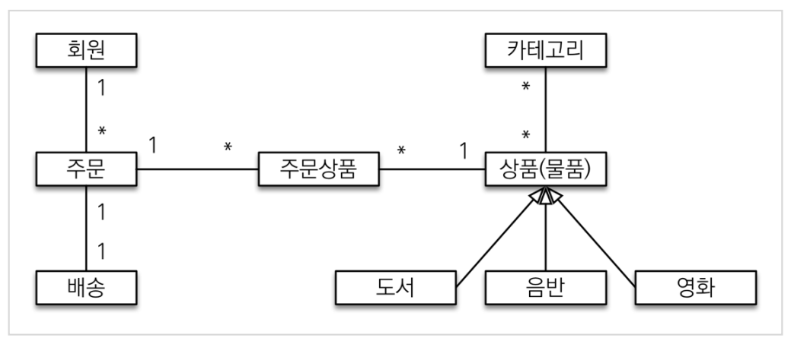
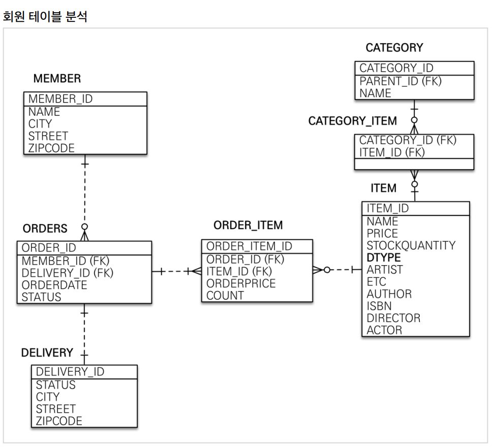
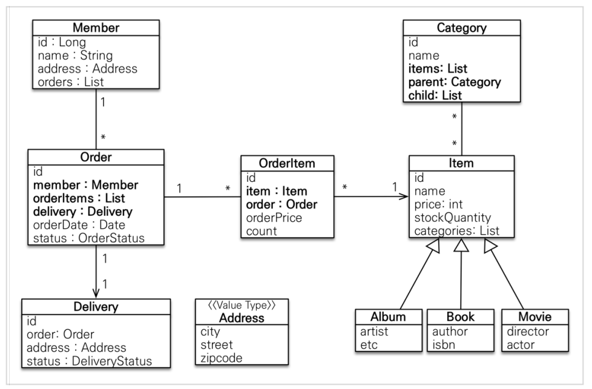

# JPA활용 1편 복습

# ❰❰ 도메인 분석 설계 ❱❱

## [ 요구사항 분석 ]

### 회원 기능

- 회원 가입
- 회원 목록

### 상품 기능

- 상품 등록
- 상품 목록

### 주문 기능

- 상품 주문
- 주문 내역

</br>

## [ 기능목록 ]

### 회원 기능

- 회원 등록
- 회원 조회

### 상품 기능

- 상품 등록
- 상품 수정
- 상품 조회

### 주문  기능

- 상품 주문
- 주문 취소
- 주문 내역 조회

### 기타 요구사항

- 상품 재고 관리
- 상품 종류 :   도서, 음반, 영화
- 상품 카테고리
- 주문 시, 배송정보 입력


</br>

# (TIP) 도메인과 도메인 모델

## [ 도메인 ]

→ 해결하고자 하는 문제 영역

*A domain is a field of study that defines a set of common requirements, terminology, and functionality for any software program constructed to solve a problem in the area of computer programming, known as domain engineering.*

</br>


## [ 도메인 모델 ]

- *도메인 모델이란 특정 문제와 관련된 모든 주제의 개념 모델이다. 도메인 모델은 다양한 엔티티, 엔티티의 속성, 역할, 관계, 제약을 기술한다. →* 특정 도메인을 개념적으로 표현한 것이다.
- 솔루션을 기술하지는 않는다.
- 유스케이스와의 비교
    - 유스케이스가 도메인의 동적 측면을 보여준다.
    - 도메인 모델은, 도메인의 정적 측면을 보여준다.
- 여기서 사용하는 건 → “객체 기반 도메인 모델”

---

</br>

# ❰❰ 도메인 모델과 테이블 설계 ❱❱

## [ 도메인 모델 ]

<center>
  
</center>

</br>

## [ 테이블 ]

<center>
  
</center>

</br>

# [ 엔티티 ]

**************************엔티티 모델**************************

<center>
  
</center>
</br>


# [ 연관관계 매핑 ]

- 연관관계의 주인
    
    → 단지, 외래키를 관리하는 것을 의미한다고 생각하자. 즉 외래키가 있는 테이블을 생각하자.
    
    착각 :   비즈니스 논리 상 우위의 있는게 아니다.
    
- 일대다 관계에서는 “다”쪽이 외래키가 있음으로, 여기가 연관관계 주인이 되게 정하자.


</br>

---

# ❰❰ 엔티티 클래스 개발 ❱❱

## 엔티티 클래스 개발 시, Getter와 Setter

이론적

- Getter, Setter 다 제공하지 않는다. 직접 접근 못하게 하고, 꼭 필요한 별도의 메서드를 제공하도록 한다.
- 하지만, 실무에서는 개발의 편의상, Getter는 만들고 열어두는게 좋다.
- Setter는 데이터가 변하기 때문에, 기본적으로 막아둔다. 대신 명확한 비즈니스 메서드를 별도로 제공한다.


</br>

## [ 회원 엔티티 ]

```java
@Entity
@Getter @Setter
public class Member {

	 @Id @GeneratedValue
	 @Column(name = "member_id")
	 private Long id;

	 private String name;

	 @Embedded
	 private Address address;

	 @OneToMany(mappedBy = "member")
	 private List<Order> orders = new ArrayList<>();
}
```

### 멤버변수로 구현

- id
- name

### 값 타입 (임베디드 타입)으로 구현

- CITY
- STREET
- ZIPCODE
    
    ⇒ 	 값타입 변수 Address 로 구현
    

### 연관관계 매핑

- @OneToMany **List<Order>**

</br>

## [ Address 값 타입 ]

```java
@Embeddable
@Getter
public class Address {
	// private 으로 구현
	 private String city;
	 private String street;
	 private String zipcode;

	 protected Address() {
	 }
	
	// 생성자로 초기화 값 입력
	 public Address(String city, String street, String zipcode) {
		 this.city = city;
		 this.street = street;
		 this.zipcode = zipcode;
	 }

	// Setter 없음 -> 초기화 이후 변경 불가능하게.
}
```

### Adress 값타입 특징

- 값 타입으로 구현하였고
- 생성자로 초기화 값 입력해서 만든다.
- Setter가 없어서 변경이 불가능하다.

</br>

### [ 주문 엔티티 ]

```java
@Entity
@Table(name = "orders")
@Getter @Setter
public class Order {
	 @Id @GeneratedValue
	 @Column(name = "order_id")
	 private Long id;

	 @ManyToOne(fetch = FetchType.LAZY)
	 @JoinColumn(name = "member_id")
	 private Member member; //주문 회원

	 @OneToMany(mappedBy = "order", cascade = CascadeType.ALL)
	 private List<OrderItem> orderItems = new ArrayList<>();

	 @OneToOne(cascade = CascadeType.ALL, fetch = FetchType.LAZY)
	 @JoinColumn(name = "delivery_id")
	 private Delivery delivery; //배송정보

	 private LocalDateTime orderDate; //주문시간

	 @Enumerated(EnumType.STRING)
	 private OrderStatus status; //주문상태 [ORDER, CANCEL]

	 //==연관관계 메서드==//
	 public void setMember(Member member) {
		 this.member = member;
		 member.getOrders().add(this);
	 }

	 public void addOrderItem(OrderItem orderItem) {
		 orderItems.add(orderItem);
		 orderItem.setOrder(this);
	 }

	 public void setDelivery(Delivery delivery) {
		 this.delivery = delivery;
		 delivery.setOrder(this);
	 }
}
```

### 주문 엔티티 특징

- @Table(name=”orders”) 사용
- 모든 테이블 컬럼 값 구현
- 주문상태는 EnumType

### 연관관계 구현

- @ManyToOne(fetch = FetchType.LAZY)
	 @JoinColumn(name = "member_id")
	 private Member member; //주문 회원

- @OneToMany(mappedBy = "order", cascade = CascadeType.ALL)
	 private List<OrderItem> orderItems = new ArrayList<>();

### 메서드

연관관계 메서드 구현. 

member, order, delivery에,  this 즉 order 넣어줌

</br>

## [ 주문 상태 ]

```java
package jpabook.jpashop.domain;
public enum OrderStatus {
	 ORDER, CANCEL
}
```

### 주문 상태 특징

테이블의 상태가 ORDER, CANCEL 2가지 경우

→ enum으로 구현

</br>

## [ 주문-상품 엔티티 ]

```java
@Entity
@Table(name = "order_item")
@Getter @Setter
public class OrderItem {
	 @Id @GeneratedValue
	 @Column(name = "order_item_id")
	 private Long id;

	 @ManyToOne(fetch = FetchType.LAZY)
	 @JoinColumn(name = "item_id")
	 private Item item; //주문 상품

	 @ManyToOne(fetch = FetchType.LAZY)
	 @JoinColumn(name = "order_id")
	 private Order order; //주문

	 private int orderPrice; //주문 가격
	 private int count; //주문 수량
}
```

### 특징

@Table 사용

</br>

## [ 상품 엔티티 ]

```java
@Entity
@Inheritance(strategy = InheritanceType.SINGLE_TABLE)
@DiscriminatorColumn(name = "dtype")
@Getter @Setter
public abstract class Item {
	 @Id @GeneratedValue
	 @Column(name = "item_id")
	 private Long id;

	 private String name;

	 private int price;

	 private int stockQuantity;

	 @ManyToMany(mappedBy = "items")
	 private List<Category> categories = new ArrayList<Category>();
}
```

### 상품 엔티티 특징

- 상속시킬 엔티티다.  즉 **“추상 클래스”** 로 구현하였다. @Inheritance 사용
- 상속된 엔티티들 타입으로 분류할 것 @DiscriminatorColumn(name = "dtype")
- 테이블의 ARTIST ~ ACTOR까지는, 카테고리와 상속받은 자식 클래스를 이용하여 구현

</br>

## [ 각 상품 엔티티 ]

### 도서

```java
@Entity
@DiscriminatorValue("B")
@Getter @Setter
public class Book extends Item {
 private String author;
 private String isbn;
}
```

### 음반

```java
@Entity
@DiscriminatorValue("A")
@Getter @Setter
public class Album extends Item {
 private String artist;
 private String etc;
}
```

### 영화

```java
@Entity
@DiscriminatorValue("M")
@Getter @Setter
public class Movie extends Item {
 private String director;
 private String actor;
}
```

</br>

## [ 카테고리 엔티티 ]


```java
@Entity
@Getter @Setter
public class Category {
	 @Id @GeneratedValue
	 @Column(name = "category_id")
	 private Long id;

	 private String name;

	 @ManyToMany
	 @JoinTable(name = "category_item",
	 joinColumns = @JoinColumn(name = "category_id"),
	 inverseJoinColumns = @JoinColumn(name = "item_id"))
	 private List<Item> items = new ArrayList<>();

	 @ManyToOne(fetch = FetchType.LAZY)
	 @JoinColumn(name = "parent_id")
	 private Category parent;

	 @OneToMany(mappedBy = "parent")
	 private List<Category> child = new ArrayList<>();

	 //==연관관계 메서드==//
	 public void addChildCategory(Category child) {
		 this.child.add(child);
		 child.setParent(this);
	 }
}
```

</br>

## [ 배송 엔티티 ]

```java
@Entity
@Getter @Setter
public class Delivery {
	 @Id @GeneratedValue
	 @Column(name = "delivery_id")
	 private Long id;

	 @OneToOne(mappedBy = "delivery", fetch = FetchType.LAZY)
	 private Order order;

	 @Embedded
	 private Address address;

	 @Enumerated(EnumType.STRING)
	 private DeliveryStatus status; //ENUM [READY(준비), COMP(배송)]
}
```

</br>

## [ 배송 상태 ]

```java
public enum DeliveryStatus {
 READY, COMP
}
```
