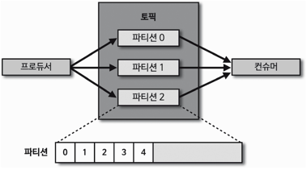

### Kafka

# Apache Kafka란?
Apache Kafka is an open-source distributed event streaming platform used by thousands of companies for high-performance data pipelines, streaming analytics, data integration, and mission-critical applications.

Apache Kafka는 고성능 데이터 파이프라인, 스트리밍 분석, 데이터 통합 및 미션 크리티컬 애플리케이션을 위해 수천 개의 회사에서 사용하는 오픈 소스 분산 이벤트 스트리밍 플랫폼입니다.

- 카프카 내부에 데이가 저장되는 **파티션**의 동작은 FIFO(First In First Out) 방식의 큐 자료구조와 유사하다. 
- 큐에 데이터를 보내는 것이  **'프로듀서'** 이고, 큐에서 데이터를 가져가는 것이 **'컨슈머'** 이다.
- 카프카를 통해 전달할 수 있는 데이터 포맷은 사실상 제한이 없다. 직렬화, 역질렬화를 통해, ByteArray로 통신하기 때문에, 자바에서 선언 가능한 모든 객체를 지원한다. ByteArray, ByteBuffer, Double, Long, String 타입에 대응한 직렬화, 역질렬화 클래스가 제공된다. 만약, 필요할 경우, 카프카에서 제공하는 커스텀 직렬화/역직렬화 클래스(Serializer<T>, Deserializer<T>)를 상속받아 개발에 사용할 수 있다.
- 상용 환경에서는 , 카프카를 최소 3대 이상의 서버(브로커)를 운영하는 것을 추천한다.
- 3대 중 일부 서버에 장애가 발생하더라도, 데이터를 지속적으로 복제하므로, 안전하게 운영할 수 있다.
- 데이터를 묶음 단위로 처리하는, **배치 전송** 을 통해, 낮은 지연과 높은 데이터 처리량을 가지고 있다.
- github (https://github.com/apache/kafka) 에 오픈소스로 공유되어 있어, 동작 방식을 확인할 수 있다.
